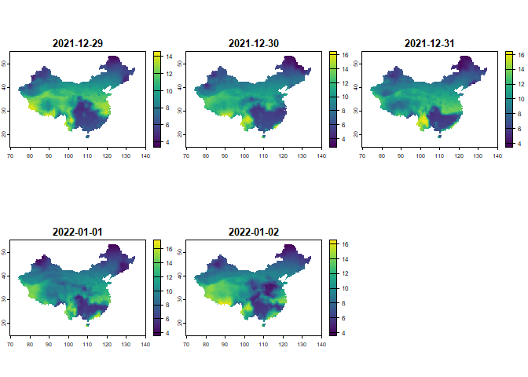

<!-- README.md is generated from README.Rmd. Please edit that file -->

# sola

<!-- badges: start -->
<!-- badges: end -->

The goal of `sola` is to provide tools for solar resource assessment and
utilization. This package implements the function of calculating solar
radiation based on sunshine hours, latitude, and other related
parameters. Compared with other existing packages, the main advantage of
`sola` is the use of vectorization operations, allowing for efficient
calculation of large datasets. The package is continuously updated to
include more functions relevant to solar energy resource assessment.

## Installation

You can install the development version of sola from
[GitHub](https://github.com/) with:

``` r
# install.packages("devtools")
devtools::install_github("renliang1996/sola")
```

## Example

### Basic Calculation of Solar Radiation

Here is a simple example of calculating solar radiation:

``` r
library(sola)

# Calculate solar radiation for March 15, 2023, at latitude 35 with 8 hours of sunshine
calc_Rs(lat = 35.0, date = as.Date("2023-03-15"), ssd = 8)
#> [1] 17.39019
```

### Vectorization calculation

To address the limitation of certain packages that can only input a
single value, we can input a vector for computation:

``` r
latitudes <- c(35, -15, 50)
dates <- as.Date(c("2023-03-15", "2024-06-21", "2023-11-01"))
sunshine_hours <- c(8, 10, 6)

calc_Rs(lat = latitudes, date = dates, ssd = sunshine_hours)
#> [1] 17.390195 18.596638  7.233635
```

### Performance Testing with Large Datasets

The following example demonstrates how `sola` can handle a dataset with
10,000 records efficiently:

``` r
set.seed(123)
test_lat <- runif(10000, -90, 90)
test_date <- as.Date("2023-01-01") + sample(1:365, 10000, replace = TRUE)
test_ssd <- runif(10000, 0, 24)

system.time({
  results <- calc_Rs(lat = test_lat, date = test_date, ssd = test_ssd)
})
#> 用户 系统 流逝 
#> 0.15 0.00 0.15
```

``` r
head(results)
#> [1] 37.187776 33.641994 23.242994  1.107624  0.000000  4.139500
```

## Advanced Usage

### Calculating Solar Radiation from NetCDF Data

The `radNC` function computes daily solar radiation for each pixel in a
SpatRaster object using sunshine duration data from a NetCDF file,
applying the Angstrom-Prescott model. Here’s a step-by-step guide:

``` r
library(terra)
#> terra 1.7.78
```

``` r
# Assuming 'ssd.nc' is a NetCDF file with the required data
filename <- system.file("extdata", "ssd.nc", package = "sola")
ssd <- rast(filename)
plot(ssd)
```


Before running the computation, ensure that the necessary libraries are
loaded and data is correctly formatted.

``` r
#Set the negative values of SSD to 0, and if na_neg is TRUE, then set it to NA.
result_raster <- radNC(ssd, na_neg = FALSE) 
#>   |                                                                              |                                                                      |   0%  |                                                                              |==============                                                        |  20%Estimated remaining time: 2.8 secs  |                                                                              |============================                                          |  40%Estimated remaining time: 2.2 secs  |                                                                              |==========================================                            |  60%Estimated remaining time: 1.5 secs  |                                                                              |========================================================              |  80%Estimated remaining time: 0.73 secs  |                                                                              |======================================================================| 100%Estimated remaining time: 0 secs
#> 
#> Total computation time: 3.8 secs
```

``` r

# Plot the result
plot(result_raster)
```



Note that the running time depends on the size of your file.

This example demonstrates how to use the `radNC` function to compute
solar radiation from NetCDF data. Make sure to have the terra package
installed and the appropriate NetCDF file available for this to work.
